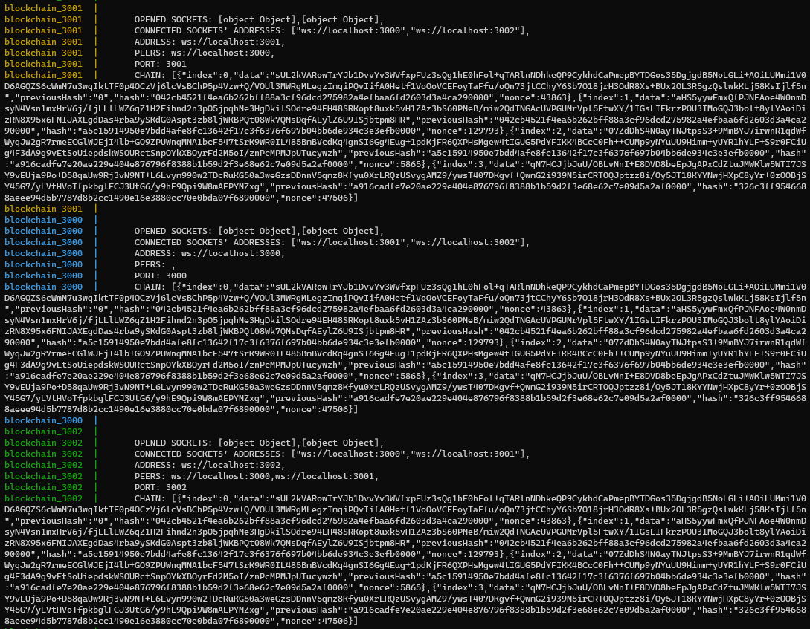

<h1 align="center">:white_small_square::white_medium_square::white_large_square: chain-net :white_large_square::white_medium_square::white_small_square:</h1>

Small blockchain pet-project created as part of the courses "Development of network applications" and "Software testing"

<a style="color: #ccc" href="https://github.com/SemenMartynov/Software-Engineering-2022/blob/main/NetworkProgrammingTask.md">Link to the task</a>

---

<h2>Running the app (Docker)</h2>
1. Install Docker
2. Clone
   
   `git clone https://github.com/alyona-korenkovich/chain-net.git`
   
   `cd chain-net`
3. Run `docker compose up`
4. Voilà -- three nodes are started and now mining on ports 3000, 3001, 3002

---

<h2>Example</h2>
On the image below one can see what it looks like when containers are running in console. 
>It needs to be noticed that containers require ports 3000-3002 to be available since it is a study-project, and they are hard-coded.

As we can see on the screen, all three nodes are connected to one another and have synchronized chains.

---

<h2>Testing</h2>
The application has been tested. 
The repository contains the following types of tests:
* Unit tests 
* Integration tests
* E2E tests

<h3>Test coverage:</h3>

| File          | % Stmts | % Branch | % Funcs | % Lines |                               
|---------------|---------|----------|---------|---------|
| All files     | 72.12   | 61.92    | 72.27   | 62.97   | 
| Block.ts      | 100     | 100      | 100     | 100     |                                                   
| Blockchain.ts | 100     | 100      | 100     | 100     |                   
| const.ts      | 100     | 100      | 100     | 100     |
